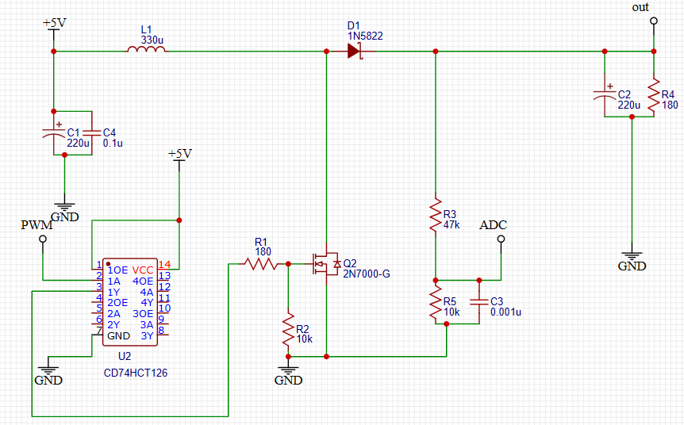
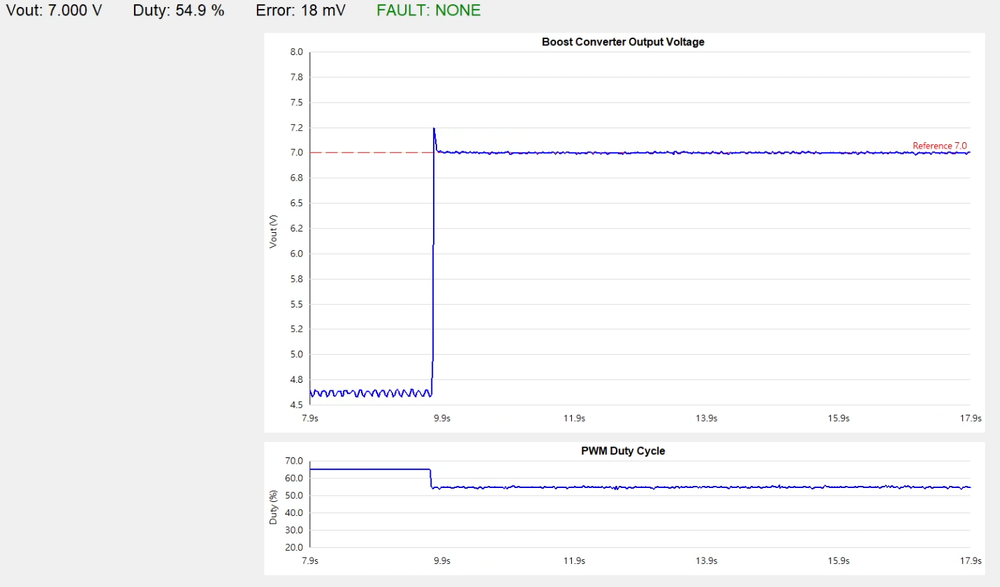

# STM32 ADC / PWM Peripheral Study
## — Boost Converter Implementation

## 1. Why — 學習目的

本專案主要目的為學習 **STM32 ADC、Timer、PWM 等 MCU 周邊的設定與使用**，並透過實際電路了解各周邊之間的整合方式。

主要學習內容：

- **PWM / Timer**
  - 使用 Timer 產生固定頻率 PWM。
  - 透過 Compare Register 改變 Duty Cycle。

- **ADC**
  - 使用 ADC 量測類比電壓。
  - 將 ADC Raw Data 轉換為實際輸出電壓。

- **Timer Trigger**
  - 使用 Timer 週期性觸發 ADC。
  - 建立固定 Sampling Rate。

- **Interrupt**
  - ADC Conversion Complete 後進入 Callback。
  - 執行量測更新與控制。

- **UART**
  - 將 Vout、Error、Duty、Fault 等資料輸出至 PC，方便觀察系統狀態。

為了將上述 MCU 周邊應用於實際系統，本專案選擇 **Boost Converter** 作為實作平台。

---

## 2. How — Boost Converter 實作

### 系統目標

使用 STM32 控制 Boost Converter：

- Input Voltage：5 V
- Target Output Voltage：7 V
- PWM Switching Frequency：100 kHz
- ADC Sampling Frequency：5 kHz

系統透過 ADC 量測 Boost Converter 的輸出電壓，再根據 Feedback 調整 PWM Duty Cycle。

### 系統架構

```text
                  +----------------+
                  | STM32F401      |
                  |                |
                  | TIM3 PWM       |
                  | 100 kHz        |
                  +-------+--------+
                          |
                          | PWM
                          v
                  +----------------+
                  | Boost          |
        5 V ----> | Converter      | ----> Vout
                  +----------------+        |
                                          |
                                    Voltage Divider
                                      47k / 10k
                                          |
                                          v
                                      ADC1 PA0
                                          ^
                                          |
                                  TIM2 Trigger 5 kHz
                                          |
                                          v
                                ADC Complete Interrupt
                                          |
                                   Measurement
                                          |
                                          v
                                     PI Control
                                          |
                                          v
                                  Update PWM Duty
```

### Peripheral 設定

| Peripheral | 設定 | 用途 |
|---|---:|---|
| TIM3 PWM | 100 kHz | Boost MOSFET Switching |
| TIM2 | 5 kHz | ADC Trigger |
| ADC1 CH0 | 12-bit | Vout Feedback |
| ADC Interrupt | 5 kHz | Measurement / Control |
| TIM4 | 50 Hz | Telemetry Scheduler |
| USART2 | 115200 baud | Data Output |

---

## 3. What — 實作內容

### PWM

使用 TIM3 產生 **100 kHz PWM**，並透過改變 Compare Register 控制 Duty Cycle。

```text
PWM Frequency = 100 kHz
Duty Range    = 15% ~ 65%
```

PWM Duty 為 Boost Converter 的主要控制輸入。

---

### ADC

使用 ADC1 Channel 0 量測 Boost Converter Feedback Voltage。

ADC Resolution：

```text
12 bit
ADC Raw = 0 ~ 4095
```

輸出端使用：

```text
Rtop    = 47 kΩ
Rbottom = 10 kΩ
```

進行電壓分壓。

因此：

\[
V_{out}
=
V_{ADC}
\times
\frac{47k+10k}{10k}
\]

ADC 由 TIM2 以 **5 kHz** 固定頻率觸發。

```text
TIM2
  |
  | 5 kHz Trigger
  v
ADC Conversion
  |
  v
ADC Complete Interrupt
  |
  v
Calculate Vout
```

---

### ADC + PWM 整合

每次 ADC Conversion Complete 後：

```text
ADC Measurement
      |
      v
Calculate Vout
      |
      v
Protection Check
      |
      v
PI Controller
      |
      v
Calculate Duty
      |
      v
Update PWM
```

因此：

```text
PWM Switching Frequency = 100 kHz
ADC Sampling Frequency  =   5 kHz
Control Update Frequency =  5 kHz
```

也就是每約 **20 個 PWM switching cycles** 更新一次控制輸出。

---

### PI Closed-loop Control

為了驗證 ADC Feedback 與 PWM Duty 能形成完整控制流程，加入簡單 PI Controller。

控制誤差：

\[
e = V_{ref}-V_{out}
\]

PWM Duty：

\[
Duty
=
Duty_{FF}
+
K_p e
+
K_i\int e\,dt
\]

控制目標：

```text
Vref = 7 V
```

PI Controller 並非本專案主要研究重點，而是用來驗證：

> ADC Measurement → Feedback → Control → PWM Update

這個完整 MCU 控制流程。

---

### UART Telemetry

為方便觀察 ADC Measurement 與 PWM Duty，透過 UART 輸出：

```text
Sample Count
Vout
Error
PWM Duty
OVP Fault
Feedback Fault
```

ADC Sampling Rate 為：

```text
5 kHz
```

每 100 次 ADC Measurement 計算一次平均值：

\[
5000 / 100 = 50Hz
\]

因此 UART 顯示資料約以 **50 Hz** 更新。

> 100-sample average 僅用於 Telemetry 顯示，PI Controller 仍使用 5 kHz ADC Measurement。

---

## 4. Result — 實驗結果


### 180 Ω Load Test



實際以 **180 Ω 負載**進行測試。

| Condition | Result |
|---|---:|
| Duty = 0% | Vout ≈ 4.6 V |
| Closed-loop Steady State | Vout ≈ 7 V |
| Steady-state Duty | ≈ 55% |

實驗結果顯示：

```text
ADC
 ↓
Vout Measurement
 ↓
Feedback Control
 ↓
PWM Duty Adjustment
 ↓
Vout ≈ 7 V
```

系統能透過 ADC 取得輸出電壓，並根據 Feedback 調整 PWM Duty，使輸出維持於目標電壓附近。

因此本次實作完成：

- 100 kHz PWM Output
- 5 kHz ADC Sampling
- Timer-triggered ADC
- ADC Interrupt
- ADC Voltage Conversion
- PWM Duty Adjustment
- ADC / PWM Closed-loop Integration
- UART Measurement Output

> **註：** 受限於元件取得性，本實驗使用之功率元件並非針對此 Boost Converter 工作條件進行最佳化選型，因此實際 Duty 與理想模型可能存在差異。

---

## 5. Learning Result

透過 Boost Converter 實作，理解 STM32 周邊並非獨立使用，而是可以透過 Timer 與 Interrupt 建立完整的硬體資料流：

```text
Timer
  |
  +----> PWM Generation
  |
  +----> ADC Trigger
             |
             v
        ADC Measurement
             |
             v
          Interrupt
             |
             v
          Control
             |
             v
        PWM Update
```

本專案的主要學習成果為：

1. 理解 STM32 **Timer / PWM** 的基本設定方式。
2. 理解 **ADC Resolution、Sampling 與 Voltage Conversion**。
3. 使用 **Timer Trigger ADC** 建立固定取樣頻率。
4. 使用 **ADC Interrupt** 處理週期性 Measurement。
5. 將 **ADC Feedback 與 PWM Output** 整合成基本 Closed-loop Control System。
6. 使用 **UART Telemetry** 觀察 MCU 內部量測與控制狀態。

